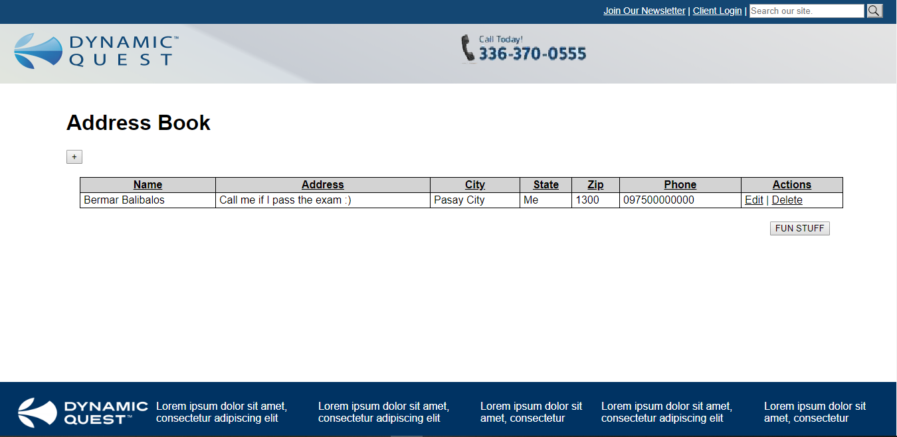

# Company Home Exam

This is a take home exam from a comany

## Getting Started

Your device should have PHP installed. You may install XAMPP or Homestead, Valet for Mac.

### Prerequisites

You need to install something for you to run a PHP script. See options below.
Text editor like Atom or VSCode

### XAMPP
https://www.wikihow.com/Install-XAMPP-for-Windows

### Homestead
https://laravel.com/docs/5.7/homestead

### Valet for Mac
https://laravel.com/docs/5.7/valet

## Folder Structure
Here's what inside the exam folder

./assets/css/style.css (a stylesheet)

./assets/images/* (images used)

./assets/js/* (javscript used including jquery)

./classes/ (nothing inside)

./database_dump/bitsavvydb.sql (database dump need to import before running the application)

./funtions/helper.php (supposed to have reusable helper functions)

./models/Address.php (A model used to handle Address data)

./models/Db.php (A class used to connect to the data)

./models/User.php (A model used to handle User data includes authentication method)

./templates/footer.php (common footer)

./templates/header.php (common header)

./autoload.php (script that auto loads classes and models)

./config.php (handles configuration setting)

./deleteAddress.php (handles address deletion)

./deleteAddress.php (handles fetch specific address)

./index.php (default landing page/ home page where it lists all address)

./login.php (a login page)

./loginProcess.php (Handles login process and authentication)

./logout.php (Handles logout and destroy session)

./processAddress.php (Handles adding and updating of address)

./README.md (youre reading it :) )

## End points

### Login

Login page

{{HOST}}/login.php

### Home

Where address displays

{{HOST}}/index.php

### Logout

Logout the page and destroy session.

{{HOST}}/logout.php

## Installation

Put the application to the root of your web server where you run your php application

Create a database named bitsavvydb in your MYSQL database server. Import the database dump located in ./database_dump folder.

## Login Credentials

Appologies the password is not incrypted/hashed :)

Username: user

Password: password

## Database

Create a database named bitsavvydb if you preferred something else change the database name in the config file (./config.php)

## The UI

Screenshot:
